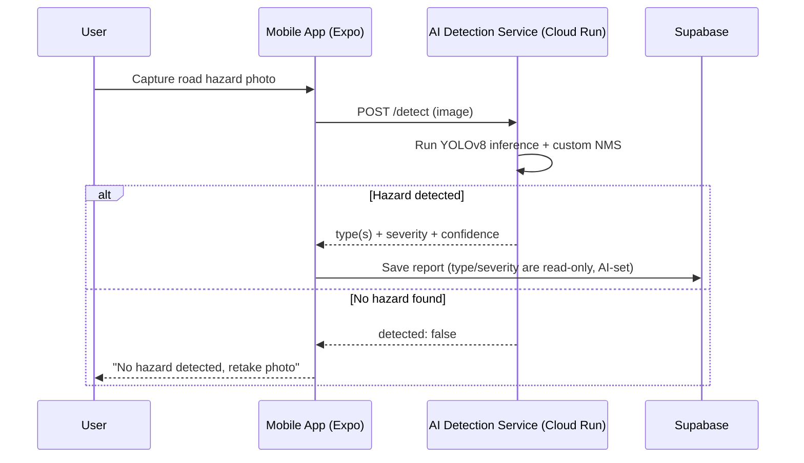

# JalanGuard AI Detection Service

A FastAPI microservice that runs a custom-trained YOLOv8 model to detect and
classify road hazards (potholes and cracks) from photos submitted through the
[JalanGuard](../) mobile app. It's the gatekeeper for every hazard report:
a photo must be verified by the model before a report can be created, and the
detected type and severity — not the user — decide what gets stored.

**Live service:** `https://jalanguard-ai-29891721130.asia-southeast1.run.app`
(deployed on Google Cloud Run — see [Deployment](#deployment))

## Running the app

**There is no local setup for this service.** It's a permanently deployed
cloud service, not something you start on your own machine before testing
the app. The mobile app is hardcoded to call the live Cloud Run URL — there
is no local/LAN mode, no environment variable to set, and nothing to run in
a second terminal.

### Prerequisites

- The [Expo Go](https://expo.dev/go) app installed on your phone.
- Your phone needs **internet access** — any Wi-Fi or cellular data works.
  It does **not** need to be on the same network as your laptop; the AI
  service lives in the cloud, not on your machine.

### Steps

```bash
cd mobile-app
npm install      # first time only
npx expo start
```

Scan the QR code with Expo Go. Capture a hazard photo in the app — it's sent
straight to the Cloud Run service and back, with no extra setup on your end.

If a photo submission ever fails with a connection error, first check
`https://jalanguard-ai-29891721130.asia-southeast1.run.app/health` in a
browser. If that returns `"model_available": true`, the service is fine and
the issue is your phone's own internet connection, not this service.

> The service scales to zero after ~15 minutes idle, so the very first
> request after a gap can take 30–50s while it cold-starts — this is
> expected, not a bug. See [Cold starts](#cold-starts) below.

## How it fits into JalanGuard



The app never lets a user pick or edit the hazard type/severity themselves —
those fields are always whatever this service returns, which keeps report
data consistent and prevents mis-tagged submissions.

## Tech stack

- **[FastAPI](https://fastapi.tiangolo.com/)** — HTTP layer, request
  validation, OpenAPI docs
- **[Ultralytics YOLOv8](https://docs.ultralytics.com/)** on CPU-only
  **PyTorch** — object detection
- **Pillow / NumPy** — image decoding and array handling
- **Docker** on **Google Cloud Run** — deployment (scale-to-zero, pay-per-use)

## The model

`best.pt` is a YOLOv8 model trained on Malaysian road-hazard imagery (see
`scripts/ai-model/`) with **six classes** that jointly encode type *and*
severity:

```
crack-low   crack-medium   crack-high
pothole-low pothole-medium pothole-high
```

A single photo can contain multiple boxes of different types and severities
(e.g. a pothole next to a crack). The service aggregates raw model output
into one result per the product's rules:

| Rule | Behavior |
| --- | --- |
| Multiple types | Every distinct base type appears in `defect_types` (e.g. both `crack` and `pothole`) |
| Multiple severities | `severity` is the **mean** across all boxes (low=1, medium=2, high=3, rounded; ties round up to the more severe reading) |
| `primary_type` | The single most-severe box's type — populates the legacy single-value `defect_type` column so existing dashboard/API filters keep working |
| Overlapping boxes | Same-type overlaps are merged via a custom Intersection-over-Minimum (IoMin) NMS; a smaller box of a **different** type nested inside a larger one is kept, not suppressed (e.g. a pothole inside a larger cracked area) — ported from `scripts/ai-model/model-testing.py` so the live service and the offline evaluation script agree box-for-box |

## API reference

Interactive docs are always available at `/docs` (Swagger UI) and `/redoc`.

| Method | Path | Purpose |
| --- | --- | --- |
| `POST` | `/detect` | Analyze an uploaded photo, return the aggregated result |
| `GET` | `/health` | Liveness probe — also confirms the model actually loads |
| `GET` | `/docs` | Swagger UI |

### `POST /detect`

`multipart/form-data` with a single field **`image`** (JPEG/PNG/WebP/BMP, ≤10 MB).

```bash
curl -X POST https://jalanguard-ai-29891721130.asia-southeast1.run.app/detect \
  -F "image=@pothole.jpg"
```

**200 — hazard detected:**

```json
{
  "detected": true,
  "defect_types": ["crack", "pothole"],
  "primary_type": "pothole",
  "severity": "medium",
  "confidence": 0.83,
  "detection_count": 3,
  "detections": [
    { "type": "pothole", "severity": "high", "confidence": 0.91, "box": [x1, y1, x2, y2] }
  ],
  "message": "Detected 3 hazards: crack and pothole."
}
```

**200 — no hazard found** (still HTTP 200 — a valid photo with nothing to
report is not an error; the caller shows a message and doesn't submit):

```json
{ "detected": false, "defect_types": [], "detection_count": 0, "message": "No road hazard detected. Retake the photo focusing on the defect." }
```

| Status | Meaning |
| --- | --- |
| `400` | Empty or undecodable image |
| `413` | Image over the 10 MB limit |
| `415` | Unsupported content type |
| `503` | Model weights not available on the server |

### `GET /health`

```json
{ "status": "ok", "service": "JalanGuard AI Detection Service", "version": "1.0.0", "model_available": true }
```

`model_available` reflects an actual model **load** attempt (cached after the
first success), not just that `best.pt` exists on disk — a present-but-broken
model (e.g. incompatible dependency versions) shows up here rather than
silently passing while every real request fails.

## Project structure

```
ai-microservice/
├── main.py                  # FastAPI app, CORS, lifespan model warm-up, /health
├── Dockerfile                # Cloud Run image (CPU-only torch + torchvision)
├── requirements.txt
├── best.pt                  # Trained YOLOv8 weights
├── .env.example              # Optional config overrides
└── app/
    ├── core/config.py        # Env-driven settings (pydantic-settings)
    ├── models/schemas.py     # Response contract shared with the mobile app
    ├── routers/detect.py     # POST /detect — validates input, delegates to the service
    └── services/detector.py  # Model loading, inference, custom NMS, aggregation
```

## Configuration

All optional — sensible defaults are baked in (`app/core/config.py`). Copy
`.env.example` to `.env` only if you need to override something (see
[Local development](#local-development-of-this-service) below):

| Variable | Default | Purpose |
| --- | --- | --- |
| `MODEL_PATH` | `ai-microservice/best.pt` | Path to the YOLO weights |
| `CONF_THRESHOLD` | `0.25` | Minimum per-box confidence to count as a detection |
| `IOMIN_THRESHOLD` | `0.45` | IoMin overlap above which same-type boxes are merged |
| `CORS_ORIGINS` | `*` | Comma-separated allowed origins |

## Deployment

Deployed on **Google Cloud Run** — a serverless container platform chosen so
the mobile app can reach the service over any network (including cellular),
not just when the phone happens to share Wi-Fi with a developer's laptop.

Only needed when you've changed code in `ai-microservice/` and want that
change live — the mobile app always talks to whatever was last deployed here.

```bash
cd ai-microservice
gcloud run deploy jalanguard-ai \
  --source . \
  --region asia-southeast1 \
  --memory 2Gi \
  --allow-unauthenticated
```

- Run this from **inside `ai-microservice/`**, using `--source .` — not
  `--source ai-microservice` from the repo root, which would look for a
  nonexistent nested `ai-microservice/ai-microservice` folder.
- `--memory 2Gi` — the platform's 512 MiB default is too tight for
  `torch` + `ultralytics` + the loaded model weights.
- `--allow-unauthenticated` — required so the mobile app can call the
  endpoint without a Google-signed auth token.
- `gcloud` prints the live service URL on success — it stays the same across
  redeploys, so nothing else needs updating afterward.

One-time setup if `gcloud` isn't installed/authenticated yet:

```bash
gcloud auth login
gcloud config set project <your-project-id>
```

### Cold starts

The free tier scales to zero after ~15 minutes idle, so the first request
after a gap can take 30–50s to boot the container before inference even
starts — this is normal. The mobile app's request timeout (60s) accounts for
it, but if you're about to demo or present, hit `/health` once a few minutes
ahead of time so the instance is already warm.

## Local development of this service

This is **only** for iterating on the Python code itself (e.g. testing a
change to the detection logic via `/docs` or `curl`) before deploying it.
**The mobile app never talks to a local run — it always calls the deployed
Cloud Run URL.** Running this locally does not change what the app sees;
you still need to `gcloud run deploy` (above) for a code change to actually
reach the app.

```bash
cd ai-microservice
python -m venv .venv
.venv\Scripts\activate          # Windows
# source .venv/bin/activate     # macOS/Linux
pip install -r requirements.txt
uvicorn main:app --reload
```

Visit `http://localhost:8000/docs` to try the API interactively, or
`http://localhost:8000/health` to confirm the model loads.

---

Part of the [JalanGuard](../) final-year project — a citizen-reporting
platform for Malaysian road hazards.
